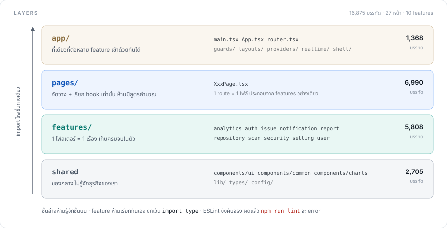
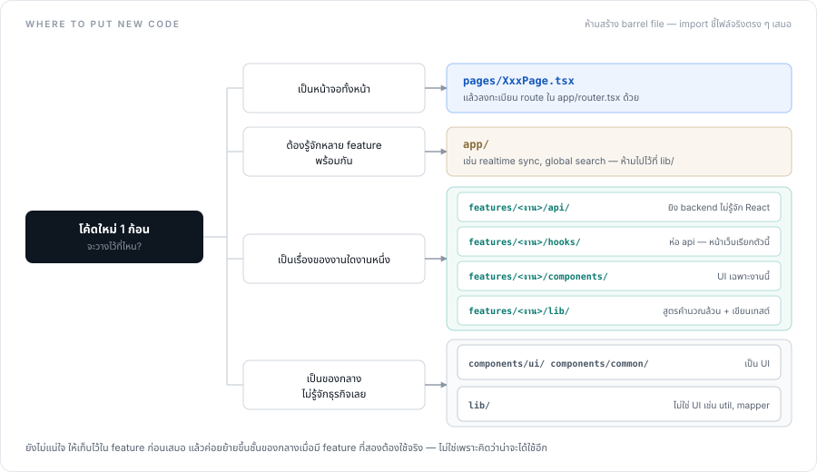
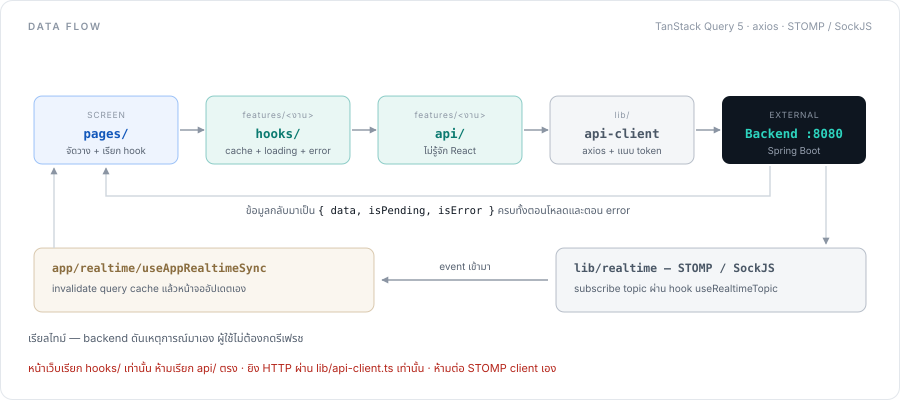
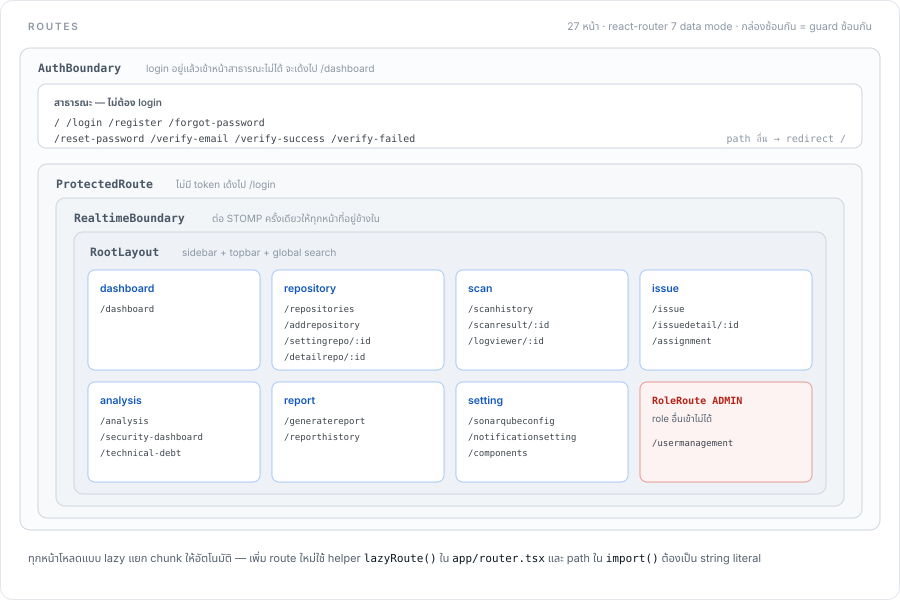

# PCCTH Automate Code Review — Frontend

หน้าเว็บของระบบตรวจโค้ดอัตโนมัติ ต่อกับ SonarQube ผ่าน backend `pccth_code_review_service`
เป็น SPA ล้วน ไม่มี SSR — React 18 + Vite + TypeScript

---

## เริ่มยังไง

| ต้องมีก่อน | เวอร์ชัน |
| --- | --- |
| Node | **22.x** (18 ทำ React พัง) |
| npm | 10+ |
| Backend | `pccth_code_review_service` รันอยู่ที่ `http://localhost:8080` |

```bash
npm install
cp .env.example .env          # bash
Copy-Item .env.example .env   # PowerShell
npm run dev                   # เปิด http://localhost:5173
```

> **ห้ามเปลี่ยน port** — backend เปิด CORS ให้ `5173` port เดียว
> ถ้ามี dev server ค้างอยู่ Vite จะเด้งไป 5174 แล้วทุก request จะโดน CORS block

| คำสั่ง | ทำอะไร |
| --- | --- |
| `npm run dev` | dev server แก้โค้ดเห็นผลทันที |
| `npm run build` | เช็ค type แล้ว build ลง `dist/` — type error = build พัง |
| `npm run preview` | เปิดดูของที่ build แล้ว |
| `npm run lint` | ESLint ตรวจโค้ด + ตรวจกฎโครงสร้าง |
| `npm test` | unit test (vitest) |

ก่อน push ให้รันครบ 4 ตัวนี้แล้วเขียว: `npx tsc -b` → `npm test` → `npm run lint` → `npm run build`

---

## โครงสร้างโค้ด



โค้ดแบ่งเป็น 4 ชั้น import ไหลขึ้นทางเดียว ชั้นล่างไม่รู้จักชั้นบนเลย
กฎนี้ **ESLint บังคับจริง** ไม่ใช่แค่ข้อตกลง — `npm run lint` จะ error ถ้าละเมิด และ CI รันให้ทุก PR

```
src/
├── app/                 ชั้นบนสุด ที่เดียวที่รู้จักได้ทุก feature
│   ├── main.tsx            จุดเริ่มของแอป โหลดธีม+ภาษา แล้วสั่ง render
│   ├── App.tsx             ครอบ provider ทั้งหมด (query, toast, router)
│   ├── router.tsx          รวม route ทุกหน้าไว้ที่เดียว
│   ├── guards/             ตัวกันทาง เช็ค login / เช็ค role ก่อนเข้าหน้า
│   ├── layouts/            โครงหน้าหลัง login (sidebar + topbar)
│   ├── providers/          AuthProvider — session ของทั้งแอป
│   ├── realtime/           useAppRealtimeSync — ต่อ STOMP เข้ากับ query cache
│   └── shell/              GlobalCommandSearch — ค้นหาข้ามงานบน topbar
│
├── pages/               หน้าเว็บ 1 route = 1 ไฟล์ ประกอบร่างอย่างเดียว
│
├── features/            แยกตามงาน 1 โฟลเดอร์ = 1 เรื่อง
│   └── <ชื่องาน>/
│       ├── api/            ฟังก์ชันยิง backend ไม่รู้จัก React
│       ├── hooks/          ห่อ api/ ให้หน้าเว็บเรียกง่าย จัดการ loading/error/cache
│       ├── components/     UI ที่ใช้เฉพาะงานนี้
│       ├── lib/            สูตรคำนวณของงานนี้ ไม่เกี่ยวกับ UI (เขียนเทสต์ที่นี่)
│       └── types.ts        หน้าตาข้อมูลของงานนี้
│
├── components/          UI ที่ใช้ข้ามงาน
│   ├── ui/                 ของกลางที่ไม่รู้จักธุรกิจเรา
│   ├── common/             ปุ่ม ฟอร์ม modal ทั่วไป
│   └── charts/             กราฟ
│
├── config/env.ts        ที่เดียวที่อ่าน import.meta.env ได้
├── lib/                 ของกลางที่ไม่ใช่ UI — api-client, realtime, auth, toast, i18n, theme
├── types/               type ที่ใช้ข้ามชั้น
├── locales/             ไฟล์แปล en.json / th.json
├── styles/              สีธีม ตัวแปร CSS animation
└── assets/              รูป โลโก้
```

10 features: `analytics` `auth` `issue` `notification` `report` `repository` `scan` `security` `setting` `user`

---

## โค้ดใหม่ควรวางไว้ตรงไหน



---

## ข้อมูลไหลยังไง



---

## เส้นทางในเว็บ



---

**กฎทั้งหมดกอยู่ใน [`CLAUDE.md`](CLAUDE.md)** — อ่านก่อนเริ่มแก้

---

## Stack

React 18 · Vite 8 · TypeScript 6 · Tailwind CSS v4 · TanStack Query 5 · react-router 7 · Vitest 4 · i18next · axios · STOMP/SockJS · lucide-react
